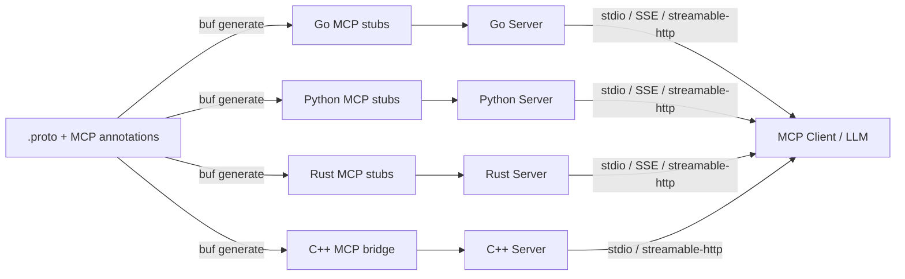
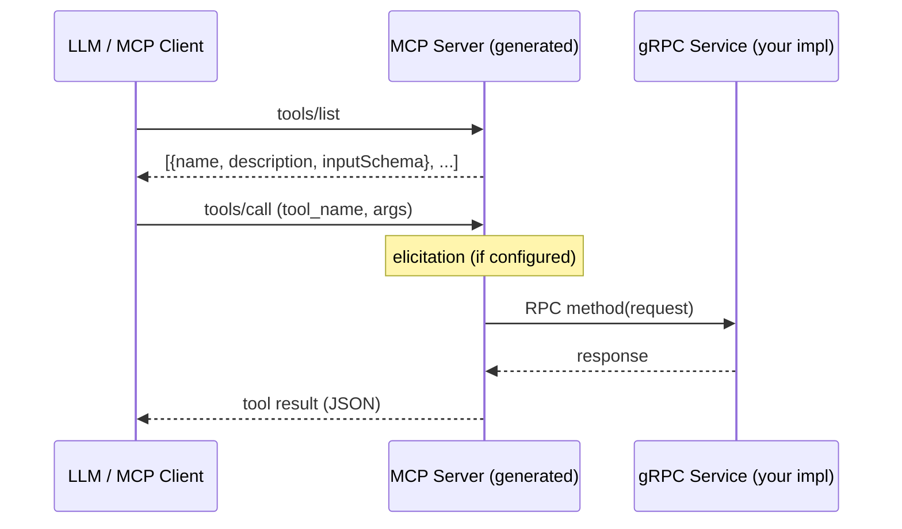

# mcp

<p align="center">
  
</p>

<p align="center">
  <strong>gRPC ↔ MCP Bridge</strong> — Generate MCP servers directly from protobufs<br>
  enabling seamless AI-native interfaces for existing services
</p>

<p align="center">
  <a href="https://go.dev/">
    
  </a>
  <a href="https://pkg.go.dev/github.com/the-protobuf-project/mcp">
    
  </a>
  <a href="https://buf.build/the-protobuf-project/mcp">
    
  </a>
</p>

## Overview

**mcp** is a `protoc` plugin that automatically converts your gRPC services
into MCP-compatible servers. The Go runtime the generated code links against
lives in [runtime-go](https://github.com/the-protobuf-project/runtime-go).

**gRPC → MCP proxy generator following the [MCP Specification](https://modelcontextprotocol.io/specification).**

Instead of rewriting APIs for AI systems, you can expose your existing
gRPC infrastructure as:

- **Tools** → callable functions for agents  
- **Prompts** → structured interaction templates  
- **Resources** → retrievable context/data  
- **Elicitation** → dynamic input flows  

Built with a **spec-first approach**, it ensures full compliance with the
Model Context Protocol while keeping your system strongly typed and scalable.

Open-sourced by **The Protobuf Project**, this project bridges traditional backend systems with AI-native platforms.

A `protoc` plugin and runtime that turns any gRPC service into a fully spec-compliant [Model Context Protocol](https://modelcontextprotocol.io/) server — tools, prompts, resources, and elicitation — in Go, Python, Rust, and C++.

## Features

- **Multi-language** — Generate MCP server code for Go, Python, Rust, and C++ from a single `.proto` file
- **Tools** — Every unary RPC becomes an MCP tool with a JSON Schema derived from the protobuf request message
- **Prompts** — Attach prompt templates to RPCs with schema-validated arguments via `(mcp.prompt)`
- **Field descriptions** — Add `(mcp.field) = { description: "..." }` to message fields for schema descriptions
- **Enum descriptions** — Add `(mcp.enum)` and `(mcp.enum_value)` for enum-level and per-value descriptions in the schema
- **Progress** — Use gRPC server streaming with `mcp.MCPProgress` for MCP progress notifications on long-running tools
- **Resources** — Auto-detect MCP resources from `google.api.resource` annotations
- **Elicitation** — Generate confirmation dialogs before tool execution via `(mcp.elicitation)`
- **Transports** — stdio, SSE, and streamable-http — run multiple concurrently in a single process
- **gRPC Gateway** — Forward MCP tool calls to a remote gRPC server (Go)
- **Published Protos** — Import the MCP annotations from [`buf.build/the-protobuf-project/mcp`](https://buf.build/the-protobuf-project/mcp) and generate the types in your own client

| Language   | Generated File                     | Example                              |
| ---------- | ---------------------------------- | ------------------------------------ |
| **Go**     | `*_service.pb.mcp.go`              | [`examples/go`](examples/go)         |
| **Python** | `*_service_pb2_mcp.py`             | [`examples/python`](examples/python) |
| **Rust**   | `*_service.mcp.rs`                 | [`examples/rust`](examples/rust)     |
| **C++**    | `*_service.mcp.h/cc` + Rust bridge | [`examples/cpp`](examples/cpp)       |

## Architecture



## How It Works



1. **Annotate** your `.proto` services with MCP options (tools, prompts, resources, elicitation).
2. **Generate** MCP server code with `buf generate` using `protoc-gen-mcp`.
3. **Implement** your gRPC service logic as usual.
4. **Serve** — the generated code starts an MCP server on your chosen transport(s).
5. **Connect** — MCP clients (Claude Desktop, MCP Inspector, custom LLM agents) discover and invoke your tools.

## Install

### Plugin

```bash
go install github.com/the-protobuf-project/mcp/plugin/cmd/protoc-gen-mcp@latest
```

Or download a binary from [GitHub Releases](https://github.com/the-protobuf-project/mcp/releases).

### MCP annotation types

The MCP annotation types (`mcp.*`) are needed at runtime so generated code can
resolve its imports — just like `googleapis-common-protos` for Google API types.

They come from the published Buf module,
[`buf.build/the-protobuf-project/mcp`](https://buf.build/the-protobuf-project/mcp),
in every language — this repository ships the plugin and the `.proto` files, and
generates no language bindings of its own.

- **Go** — the registry builds them for you:
  `go get buf.build/gen/go/the-protobuf-project/mcp/protocolbuffers/go`.
- **Other languages** — add the module as a dependency and generate the types in
  your own client (see [Quick Start](#quick-start) below).

## Quick Start

### 1. Add the proto dependency

```yaml
# buf.yaml
version: v2
deps:
  - buf.build/googleapis/googleapis
  - buf.build/the-protobuf-project/mcp
```

```bash
buf dep update
```

### 2. Annotate your proto

```protobuf
syntax = "proto3";
package todo.v1;

import "mcp/protobuf/annotations.proto";

service TodoService {
  option (mcp.service) = {
    app: {
      name: "Todo App"
      version: "1.0.0"
      description: "A simple todo management application"
    }
  };

  rpc CreateTodo(CreateTodoRequest) returns (Todo) {
    option (mcp.tool) = {
      description: "Creates a new todo item."
    };
    option (mcp.elicitation) = {
      message: "Please confirm the todo details before creating."
      schema: "todo.v1.CreateTodoConfirmation"
    };
  }

  rpc GetTodo(GetTodoRequest) returns (Todo) {
    option (mcp.tool) = {
      description: "Retrieves a todo by resource name."
    };
    option (mcp.prompt) = {
      name: "summarize_todos"
      description: "Summarize all pending todo items for a user"
      schema: "todo.v1.SummarizeTodosArgs"
    };
  }
}

// Enum with descriptions for MCP tool schema
enum Priority {
  option (mcp.enum) = { description: "Priority level for a todo item." };

  PRIORITY_UNSPECIFIED = 0 [(mcp.enum_value) = { description: "Unspecified; use default priority." }];
  PRIORITY_LOW = 1 [(mcp.enum_value) = { description: "Low priority; can be done when convenient." }];
  PRIORITY_MEDIUM = 2 [(mcp.enum_value) = { description: "Normal priority; default for most todos." }];
  PRIORITY_HIGH = 3 [(mcp.enum_value) = { description: "High priority; should be done soon." }];
  PRIORITY_URGENT = 4 [(mcp.enum_value) = { description: "Urgent; do first." }];
}
```

### 3. Generate code

```yaml
# buf.gen.yaml
version: v2
plugins:
  # --- Go ---
  - local: protoc-gen-go
    out: generated/go
    opt: [module=example/generated/go]
  - local: protoc-gen-mcp
    out: generated/go
    opt: [lang=go, module=example/generated/go]

  # --- Python ---
  - remote: buf.build/protocolbuffers/python
    out: generated/python
  - local: protoc-gen-mcp
    out: generated/python
    opt: [lang=python, paths=source_relative]

  # --- Rust ---
  - remote: buf.build/community/neoeinstein-prost
    out: generated/rust
  - local: protoc-gen-mcp
    out: generated/rust
    opt: [lang=rust, paths=source_relative]

  # --- C++ (Rust bridge + C++ gRPC client) ---
  - local: protoc-gen-mcp
    out: generated/cpp
    opt: [lang=cpp, paths=source_relative]
```

```bash
buf generate
```

### 4. Run with MCP Inspector

```bash
# Go
cd examples/go/stdio && go run .
npx @modelcontextprotocol/inspector -- go run .

# Python
cd examples/python
npx @modelcontextprotocol/inspector -- uv run python stdio/main.py

# Rust
cd examples/rust && cargo build --bin stdio
npx @modelcontextprotocol/inspector -- ./target/debug/stdio

# C++
cd examples/cpp && make
MCP_TRANSPORT=stdio npx @modelcontextprotocol/inspector -- ./server
```

## MCP Annotations

All annotations are imported from `mcp/protobuf/annotations.proto` ([BSR](https://buf.build/the-protobuf-project/mcp)).

### Service-level: `mcp.service`

Defines app metadata for the MCP server:

```protobuf
option (mcp.service) = {
  app: { name: "My App" version: "1.0.0" description: "..." }
};
```

### Tool: `mcp.tool`

Override auto-generated tool name or description:

```protobuf
rpc CreateItem(CreateItemRequest) returns (Item) {
  option (mcp.tool) = {
    name: "custom_tool_name"
    description: "Custom description for LLMs."
  };
}
```

### Prompt: `mcp.prompt`

Attach a prompt template to an RPC. The `schema` references a proto message whose fields become prompt arguments:

```protobuf
rpc GetItem(GetItemRequest) returns (Item) {
  option (mcp.prompt) = {
    name: "summarize_items"
    description: "Summarize all items"
    schema: "mypackage.SummarizeItemsArgs"
  };
}
```

### Elicitation: `mcp.elicitation`

Request user confirmation before executing a tool. The `schema` references a proto message whose fields become the confirmation form:

```protobuf
rpc DeleteItem(DeleteItemRequest) returns (google.protobuf.Empty) {
  option (mcp.elicitation) = {
    message: "Are you sure you want to delete this item?"
    schema: "mypackage.DeleteConfirmation"
  };
}
```

Elicitation is supported in all three languages with graceful degradation — if the client doesn't support elicitation, the tool proceeds without confirmation.

### Field: `mcp.field`

Add JSON Schema metadata to a message field for the MCP tool inputSchema:

```protobuf
message User {
  string name = 1 [
    (google.api.field_behavior) = IDENTIFIER,
    (mcp.field) = {
      description: "The resource name of the user. You can parse the user id from the resource name."
      examples: "users/alice"
      examples: "users/bob"
      format: "uri"           // optional: override format (uri, email, uuid, etc.)
      deprecated: false       // optional: mark field as deprecated
    }
  ];
}
```

- **description** — Human-readable description (recommended for LLMs)
- **examples** — Example values to guide LLMs (repeated)
- **deprecated** — Mark the field as deprecated in the schema
- **format** — JSON Schema format override (e.g. `uri`, `email`, `uuid`)

### Enum: `mcp.enum` and `mcp.enum_value`

Add descriptions to enum types and individual enum values for the MCP tool inputSchema:

```protobuf
enum Priority {
  option (mcp.enum) = { description: "Priority level for a todo item." };

  PRIORITY_UNSPECIFIED = 0 [(mcp.enum_value) = { description: "Unspecified; use default priority." }];
  PRIORITY_LOW = 1 [(mcp.enum_value) = { description: "Low priority; can be done when convenient." }];
  PRIORITY_MEDIUM = 2 [(mcp.enum_value) = { description: "Normal priority; default for most todos." }];
  PRIORITY_HIGH = 3 [(mcp.enum_value) = { description: "High priority; should be done soon." }];
  PRIORITY_URGENT = 4 [(mcp.enum_value) = { description: "Urgent; do first." }];
}
```

The schema includes:
- **description** — Combined enum-level and per-value descriptions
- **enumDescriptions** — Map of value name → description for structured access

For enum fields, enum descriptions take precedence over `(mcp.field)` description when both are present.

### Progress (server streaming)

For long-running operations, use gRPC server streaming with `mcp.MCPProgress` to send progress notifications to MCP clients. Define a stream response with a oneof:

```protobuf
import "mcp/protobuf/progress.proto";

message CreateTodoStreamChunk {
  oneof payload {
    mcp.MCPProgress progress = 1;
    Todo result = 2;
  }
}

rpc CreateTodo(CreateTodoRequest) returns (stream CreateTodoStreamChunk);
```

The plugin auto-generates tool handlers that send MCP `notifications/progress` for each progress chunk and return the final result. Progress is supported when using `ForwardTo*MCPClient` (gRPC forwarding). Clients request progress by including `progressToken` in `params._meta`.

**Progress and timeouts**: Long-running requests that send progress must not time out. The gateway uses `ReadTimeout: 0` and `WriteTimeout: 0` by default so streaming progress is never interrupted. If you set `WriteTimeout` in `MCPServerConfig`, use `0` or a very high value for progress-enabled tools. MCP clients (e.g. Inspector) may have their own timeout; enable timeout reset on progress when available (`MCP_REQUEST_TIMEOUT_RESET_ON_PROGRESS`). If you see **"MCP error -32001: Maximum total timeout exceeded"**, the client has a hard cap on total request time (Inspector default: 60s). Increase it, e.g. `MCP_REQUEST_MAX_TOTAL_TIMEOUT=300000` (5 min, in ms).

### Resources

Resources are auto-detected from `google.api.resource` annotations on proto messages. No additional MCP annotation is needed.

## Project Structure

```
mcp/
├── go.mod                          # Single Go module
├── go.work                         # Workspace (root + examples)
├── proto/                          # Publishable buf module (BSR)
│   └── mcp/protobuf/              # MCP annotation .proto source files
├── protobuf/                      # Pre-compiled Go proto types
│   └── mcppb/                     # Go (.pb.go) — see [protobuf/README.md](protobuf/README.md)
├── plugin/
│   ├── cmd/protoc-gen-mcp/        # Plugin binary (go install target)
│   └── generator/                 # Code generation (Go, Python, Rust, C++)
│       └── templates/             # go.tpl, python.tpl, rust.tpl, cpp/*.tpl
├── examples/                      # Separate module with replace directive
│   ├── proto/                     # TodoService + CounterService definitions
│   ├── go/                        # Go examples (http, stdio, sse, grpc-gateway, counter)
│   ├── python/                    # Python examples (http, stdio, sse)
│   ├── rust/                      # Rust examples (http, stdio, sse)
│   └── cpp/                       # C++ example (Make, gRPC + MCP via Rust bridge)
└── .github/workflows/             # CI + release pipelines
```

## Plugin Options

| Option           | Values                        | Description                                              |
| ---------------- | ----------------------------- | -------------------------------------------------------- |
| `lang`           | `go`, `python`, `rust`, `cpp` | Target language for generated code                       |
| `module`         | Go module path                | Go module prefix for output path resolution              |
| `package_suffix` | any string (Go only)          | Sub-package suffix for generated `.pb.mcp.go` files      |
| `paths`          | `source_relative`             | Place output relative to the proto source (Python, Rust) |

## Generated Code

For each proto service, the plugin generates:

| Feature             | Go                                                  | Python                                 | Rust                              | C++                              |
| ------------------- | --------------------------------------------------- | -------------------------------------- | --------------------------------- | -------------------------------- |
| **Tools** (per RPC) | `s.AddTool(...)`                                    | `@server.call_tool()`                  | `ServerHandler::call_tool()`      | `TodoServiceMcpImpl` (cxx FFI)   |
| **Prompts**         | `s.AddPrompt(...)`                                  | `@server.get_prompt()`                 | `ServerHandler::get_prompt()`     | —                                |
| **Resources**       | `s.AddResource(...)` / `s.AddResourceTemplate(...)` | `@server.list_resources()`             | `ServerHandler::list_resources()` | —                                |
| **Elicitation**     | `mcpruntime.RunElicitation(...)`                    | `session.elicit(...)`                  | `peer.create_elicitation(...)`    | —                                |
| **Serve function**  | `ServeTodoServiceMCP()`                             | `serve_todo_service_mcp()`             | `serve_todo_service_mcp()`        | `start_*_mcp_http` / `_stdio`    |
| **gRPC forwarding** | `ForwardToTodoServiceMCPClient()`                   | `forward_to_todo_service_mcp_client()` | —                                 | In-process (C++ gRPC server)     |
| **Interface/trait** | `TodoServiceMCPServer`                              | `TodoServiceMCPServer` (Protocol)      | `TodoServiceMcpServer` (trait)    | `TodoServiceMcpImpl` (C++ class) |

### JSON Schema derivation

The tool's `inputSchema` is derived from the protobuf request message:

- Field types → JSON Schema types
- `google.api.field_behavior` REQUIRED → JSON Schema `required`
- `buf.validate` constraints → `minLength`, `maxLength`, `pattern`, `minimum`, `maximum`, etc.
- Well-known types (Timestamp, Duration, FieldMask, Struct, Any, wrappers) → appropriate JSON Schema
- Protobuf `oneof` → JSON Schema `oneOf`/`anyOf`
- Enums → JSON Schema `enum` with string values; `(mcp.enum)` / `(mcp.enum_value)` → `description` and `enumDescriptions`

## Transport Configuration

### Supported transports

| Transport       | Value             | Protocol                      | Use Case                            |
| --------------- | ----------------- | ----------------------------- | ----------------------------------- |
| stdio           | `stdio`           | stdin/stdout pipes            | Local tools, IDE integrations       |
| SSE (legacy)    | `sse`             | HTTP + Server-Sent Events     | Browser clients, legacy MCP clients |
| Streamable HTTP | `streamable-http` | HTTP + bidirectional JSON-RPC | Production deployments, modern SDKs |

### Multiple transports

Run multiple transports concurrently with comma-separated values:

```bash
MCP_TRANSPORT=stdio,streamable-http go run .
MCP_TRANSPORT=stdio,streamable-http uv run python http/main.py
MCP_TRANSPORT=stdio,streamable-http cargo run --bin http
```

### Environment variables

| Variable        | Default     | Description                                        |
| --------------- | ----------- | -------------------------------------------------- |
| `MCP_TRANSPORT` | per-example | Comma-separated: `stdio`, `sse`, `streamable-http` |
| `MCP_HOST`      | `0.0.0.0`   | Bind address for HTTP transports                   |
| `MCP_PORT`      | `8082`      | Listen port for HTTP transports                    |
| `GRPC_PORT`     | `50051`     | gRPC server listen port                            |

### Go runtime configuration

The Go runtime that generated code links against lives in
[runtime-go](https://github.com/the-protobuf-project/runtime-go); this repository
ships the plugin and the annotations only.

```go
import "github.com/the-protobuf-project/runtime-go/agents/mcp"

cfg := &mcpruntime.MCPServerConfig{
    Name:       "my-service",
    Version:    "1.0.0",
    Transports: []mcpruntime.Transport{mcpruntime.TransportStdio, mcpruntime.TransportStreamableHTTP},
    Addr:       ":8082",
    BasePath:   "/todo/v1/todoservice/mcp",
}

todopbv1.ServeTodoServiceMCP(ctx, server, cfg)
```

### Python configuration

```python
from todo.v1.todo_service_pb2_mcp import serve_todo_service_mcp

serve_todo_service_mcp(impl, transport="streamable-http", host="0.0.0.0", port=8082)
```

### Rust configuration

```rust
let config = TodoServiceMcpTransportConfig {
    transport: "streamable-http".into(),
    host: "0.0.0.0".into(),
    port: 8082,
    ..Default::default()
};
serve_todo_service_mcp(server, config).await?;
```

## Examples

The [`examples/`](examples/) directory contains **TodoService** (CRUD, prompts, elicitation) and **CounterService** (progress streaming) implementations:

| Service        | Proto                    | Description                                      |
| -------------- | ------------------------ | ------------------------------------------------ |
| **TodoService** | `proto/todo/v1/`         | CRUD, prompts, elicitation, resources            |
| **CounterService** | `proto/counter/v1/`  | Server-streaming with MCP progress notifications |

| Language | Directory                             | Transports                     | Test                                    |
| -------- | ------------------------------------- | ------------------------------ | --------------------------------------- |
| Go       | [`examples/go/`](examples/go)         | http, stdio, sse, grpc-gateway, counter | `go test ./examples/go/...`      |
| Python   | [`examples/python/`](examples/python) | http, stdio, sse               | `uv run python -m pytest smoke_test.py` |
| Rust     | [`examples/rust/`](examples/rust)     | http, stdio, sse               | `cargo check`                           |
| C++      | [`examples/cpp/`](examples/cpp)       | streamable-http, stdio         | `make`                                  |

See each language's README for detailed setup and run instructions.

## Testing with MCP Inspector

```bash
# stdio (Inspector spawns the process)
npx @modelcontextprotocol/inspector -- <command>

# HTTP (start server first, then open Inspector)
npx @modelcontextprotocol/inspector
# Enter URL, e.g. http://localhost:8082/todo/v1/todoservice/mcp or http://localhost:8083/counter/v1/counterservice/mcp
```

For long-running tools with progress, increase the Inspector's max total timeout (default 60s):

```bash
MCP_REQUEST_MAX_TOTAL_TIMEOUT=300000 npx @modelcontextprotocol/inspector
```

## License

Licensed under the [Apache License, Version 2.0](LICENSE).
