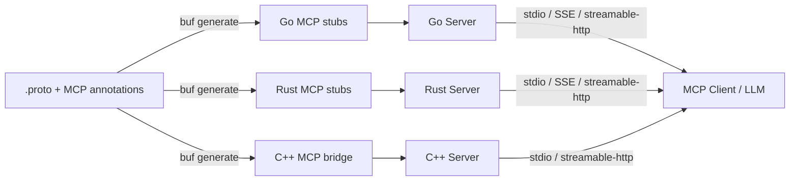
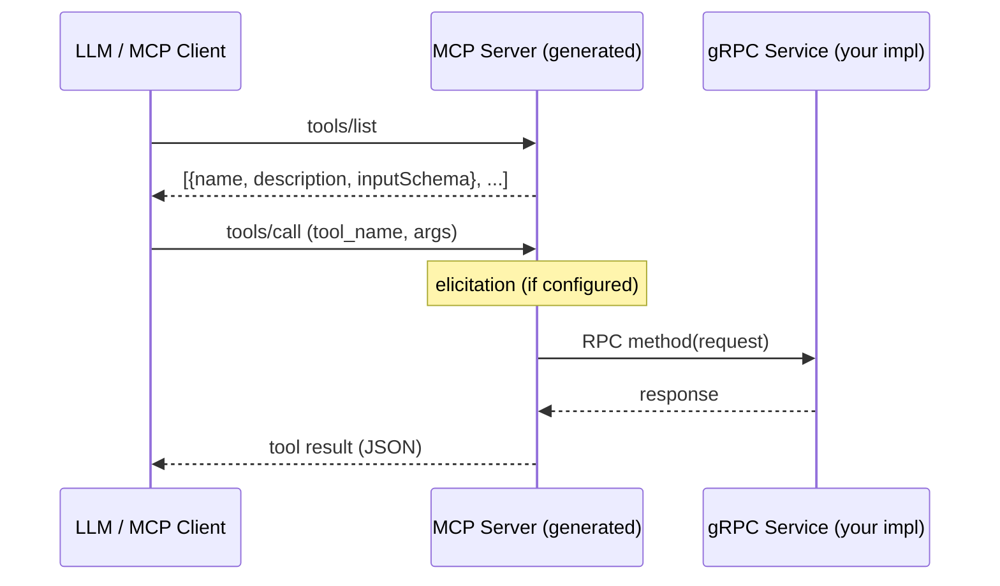

<!-- markdownlint-disable MD041 -->
<h1 align="center">MCP</h1>

<p align="center">
  <strong>One schema, every surface.</strong> mcp is a spec-first
  <code>protoc</code> plugin that generates fully compliant Model Context Protocol
  servers straight from your <code>.proto</code> files — for Go, Rust, and C++ —
  so the definitions that already describe your APIs expose them to AI clients
  too.
</p>

<p align="center">
  <strong>This release brings full support for protocol version <code>2026-07-28</code>.</strong>
</p>

<p align="center">
  <a href="https://github.com/the-protobuf-project/mcp/actions/workflows/ci.yaml"></a>
  <a href="https://github.com/the-protobuf-project/mcp/actions/workflows/release.yaml"></a>
  <a href="https://modelcontextprotocol.io/specification"></a>
  <a href="LICENSE"></a>
  <a href="https://pkg.go.dev/github.com/the-protobuf-project/mcp"></a>
  <a href="https://buf.build/the-protobuf-project/mcp"></a>
  
  
  
</p>

## Overview

Annotate your `.proto` files with MCP options and `protoc-gen-mcp` generates a
[Model Context Protocol](https://modelcontextprotocol.io/) server for each
service — no hand-written glue, and no second schema to keep in sync.

The definitions you already maintain become:

- **Tools** → callable functions for agents
- **Prompts** → structured interaction templates
- **Resources** → retrievable context/data
- **Elicitation** → dynamic input flows
- **Progress** → incremental updates for long-running calls

The generated server implements the
[MCP specification](https://modelcontextprotocol.io/specification) at protocol
version `2026-07-28` and delegates to your service implementation — in-process,
or forwarded to a remote gRPC server. Your API stays strongly typed, and the
proto remains the single source of truth.

Generated code builds on the official MCP SDKs — Go `go-sdk` v1.7+ and Rust
`rmcp` 3.1+ (which also backs the C++ bridge).

This repository ships the plugin and the annotation `.proto` files. The Go
runtime the generated code links against lives in
[runtime-go](https://github.com/the-protobuf-project/runtime-go).

Open-sourced by **The Protobuf Project**.

## Features

- **Multi-language** — Generate MCP server code for Go, Rust, and C++ from a single `.proto` file
- **Tools** — Every unary RPC becomes an MCP tool with a JSON Schema derived from the protobuf request message
- **Prompts** — Attach prompt templates to RPCs with schema-validated arguments via `(mcp.v1.prompt)`
- **Field descriptions** — Add `(mcp.v1.field) = { description: "..." }` to message fields for schema descriptions
- **Enum descriptions** — Add `(mcp.v1.enum)` and `(mcp.v1.enum_value)` for enum-level and per-value descriptions in the schema
- **Progress** — Use gRPC server streaming with `mcp.v1.MCPProgress` for MCP progress notifications on long-running tools
- **Resources** — Auto-detect MCP resources from `google.api.resource` annotations
- **Elicitation** — Generate confirmation dialogs before tool execution via `(mcp.v1.elicitation)`
- **Transports** — stdio, SSE, and streamable-http — run multiple concurrently in a single process
- **gRPC forwarding** — Forward MCP tool calls to a remote gRPC server instead of an in-process impl (Go)
- **Published Protos** — Import the MCP annotations from [`buf.build/the-protobuf-project/mcp`](https://buf.build/the-protobuf-project/mcp) and generate the types in your own client

| Language   | Generated File                     | Example                              |
| ---------- | ---------------------------------- |
| **Go**     | `*_service.pb.mcp.go`              | [`examples/go`](examples/go)         |
| **Rust**   | `*_service.mcp.rs`                 | [`examples/rust`](examples/rust)     |
| **C++**    | `*_service.mcp.h/cc` + Rust bridge | [`examples/cpp`](examples/cpp)       |

## Architecture



## How It Works



1. **Annotate** your `.proto` services with MCP options (tools, prompts, resources, elicitation).
2. **Generate** MCP server code with `buf generate` using `protoc-gen-mcp`.
3. **Implement** your gRPC service logic as usual.
4. **Serve** — the generated code starts an MCP server on your chosen transport(s).
5. **Connect** — MCP clients (Claude Desktop, MCP Inspector, custom LLM agents) discover and invoke your tools.

## Install

### Plugin

```bash
go install github.com/the-protobuf-project/mcp/plugin/cmd/protoc-gen-mcp@latest
```

Or download a binary from [GitHub Releases](https://github.com/the-protobuf-project/mcp/releases).

### MCP annotation types

The MCP annotation types (`mcp.*`) are needed at runtime so generated code can
resolve its imports — just like `googleapis-common-protos` for Google API types.

They come from the published Buf module,
[`buf.build/the-protobuf-project/mcp`](https://buf.build/the-protobuf-project/mcp),
in every language — this repository ships the plugin and the `.proto` files, and
generates no language bindings of its own.

- **Go** — the registry builds them for you:
  `go get buf.build/gen/go/the-protobuf-project/mcp/protocolbuffers/go`.
- **Other languages** — add the module as a dependency and generate the types in
  your own client (see [Quick Start](#quick-start) below).

## Quick Start

### 1. Add the proto dependency

```yaml
# buf.yaml
version: v2
deps:
  - buf.build/googleapis/googleapis
  - buf.build/the-protobuf-project/mcp
```

```bash
buf dep update
```

### 2. Annotate your proto

```protobuf
syntax = "proto3";
package todo.v1;

import "mcp/v1/annotations.proto";

service TodoService {
  option (mcp.v1.service) = {
    app: {
      display_name: "Todo App"
      version: "1.0.0"
      description: "A simple todo management application"
    }
  };

  rpc CreateTodo(CreateTodoRequest) returns (Todo) {
    option (mcp.v1.tool) = {
      description: "Creates a new todo item."
    };
    option (mcp.v1.elicitation) = {
      message: "Please confirm the todo details before creating."
      schema: "todo.v1.CreateTodoConfirmation"
    };
  }

  rpc GetTodo(GetTodoRequest) returns (Todo) {
    option (mcp.v1.tool) = {
      description: "Retrieves a todo by resource name."
    };
    option (mcp.v1.prompt) = {
      id: "summarize_todos"
      description: "Summarize all pending todo items for a user"
      schema: "todo.v1.SummarizeTodosArgs"
    };
  }
}

// Enum with descriptions for MCP tool schema
enum Priority {
  option (mcp.v1.enum) = { description: "Priority level for a todo item." };

  PRIORITY_UNSPECIFIED = 0 [(mcp.v1.enum_value) = { description: "Unspecified; use default priority." }];
  PRIORITY_LOW = 1 [(mcp.v1.enum_value) = { description: "Low priority; can be done when convenient." }];
  PRIORITY_MEDIUM = 2 [(mcp.v1.enum_value) = { description: "Normal priority; default for most todos." }];
  PRIORITY_HIGH = 3 [(mcp.v1.enum_value) = { description: "High priority; should be done soon." }];
  PRIORITY_URGENT = 4 [(mcp.v1.enum_value) = { description: "Urgent; do first." }];
}
```

### 3. Generate code

```yaml
# buf.gen.yaml
version: v2
plugins:
  # --- Go ---
  - local: protoc-gen-go
    out: generated/go
    opt: [module=example/generated/go]
  - local: protoc-gen-mcp
    out: generated/go
    opt: [lang=go, module=example/generated/go]

  # --- Rust ---
  - remote: buf.build/community/neoeinstein-prost
    out: generated/rust
  - local: protoc-gen-mcp
    out: generated/rust
    opt: [lang=rust, paths=source_relative]

  # --- C++ (Rust bridge + C++ gRPC client) ---
  - local: protoc-gen-mcp
    out: generated/cpp
    opt: [lang=cpp, paths=source_relative]
```

```bash
buf generate
```

### 4. Run with MCP Inspector

```bash
# Go
cd examples/go/stdio && go run .
npx @modelcontextprotocol/inspector -- go run .

# Rust
cd examples/rust && cargo build --bin stdio
npx @modelcontextprotocol/inspector -- ./target/debug/stdio

# C++
cd examples/cpp && make
MCP_TRANSPORT=stdio npx @modelcontextprotocol/inspector -- ./server
```

## MCP Annotations

All annotations are imported from `mcp/v1/annotations.proto` ([BSR](https://buf.build/the-protobuf-project/mcp)).

### Service-level: `mcp.v1.service`

Defines app metadata for the MCP server:

```protobuf
option (mcp.v1.service) = {
  app: { display_name: "My App" version: "1.0.0" description: "..." }
};
```

### Tool: `mcp.v1.tool`

Override auto-generated tool name or description:

```protobuf
rpc CreateItem(CreateItemRequest) returns (Item) {
  option (mcp.v1.tool) = {
    id: "custom_tool_name"
    description: "Custom description for LLMs."
  };
}
```

### Prompt: `mcp.v1.prompt`

Attach a prompt template to an RPC. The `schema` references a proto message whose fields become prompt arguments:

```protobuf
rpc GetItem(GetItemRequest) returns (Item) {
  option (mcp.v1.prompt) = {
    id: "summarize_items"
    description: "Summarize all items"
    schema: "mypackage.SummarizeItemsArgs"
  };
}
```

### Elicitation: `mcp.v1.elicitation`

Request user input before executing a tool. In **form mode**, `schema` is the
fully-qualified name of a proto message whose fields become the form:

```protobuf
rpc DeleteItem(DeleteItemRequest) returns (google.protobuf.Empty) {
  option (mcp.v1.elicitation) = {
    message: "Are you sure you want to delete this item?"
    schema: "mypackage.DeleteConfirmation"
    required: true            // optional: abort the call if the user declines
  };
}
```

In **URL mode**, the user is sent to an external URL instead of a form:

```protobuf
rpc Authenticate(AuthRequest) returns (AuthResponse) {
  option (mcp.v1.elicitation) = {
    mode: MCP_ELICITATION_MODE_URL
    message: "Complete authentication via the link below."
    url: "https://example.com/auth"
    elicitation_id: "auth-session-abc"
  };
}
```

The mode is inferred when unset — form if `schema` is set, URL if `url` is set.

Elicitation is supported in Go and Rust with graceful degradation — if the client doesn't support elicitation, the tool proceeds without confirmation. The C++ generator does not emit elicitation handlers.

### Field: `mcp.v1.field`

Add JSON Schema metadata to a message field for the MCP tool inputSchema:

```protobuf
message User {
  string name = 1 [
    (google.api.field_behavior) = IDENTIFIER,
    (mcp.v1.field) = {
      description: "The resource name of the user. You can parse the user id from the resource name."
      examples: "users/alice"
      examples: "users/bob"
      format: MCP_FIELD_FORMAT_URI  // optional: override the JSON Schema format
      deprecated: false             // optional: mark field as deprecated
    }
  ];
}
```

- **description** — Human-readable description (recommended for LLMs)
- **examples** — Example values to guide LLMs (repeated)
- **deprecated** — Mark the field as deprecated in the schema
- **format** — JSON Schema format override (e.g. `uri`, `email`, `uuid`)

### Enum: `mcp.v1.enum` and `mcp.v1.enum_value`

Add descriptions to enum types and individual enum values for the MCP tool inputSchema:

```protobuf
enum Priority {
  option (mcp.v1.enum) = { description: "Priority level for a todo item." };

  PRIORITY_UNSPECIFIED = 0 [(mcp.v1.enum_value) = { description: "Unspecified; use default priority." }];
  PRIORITY_LOW = 1 [(mcp.v1.enum_value) = { description: "Low priority; can be done when convenient." }];
  PRIORITY_MEDIUM = 2 [(mcp.v1.enum_value) = { description: "Normal priority; default for most todos." }];
  PRIORITY_HIGH = 3 [(mcp.v1.enum_value) = { description: "High priority; should be done soon." }];
  PRIORITY_URGENT = 4 [(mcp.v1.enum_value) = { description: "Urgent; do first." }];
}
```

The schema includes:
- **description** — Combined enum-level and per-value descriptions
- **enumDescriptions** — Map of value name → description for structured access

For enum fields, enum descriptions take precedence over `(mcp.v1.field)` description when both are present.

### Progress (server streaming)

For long-running operations, use gRPC server streaming with `mcp.v1.MCPProgress` to send progress notifications to MCP clients. Define a stream response with a oneof:

```protobuf
import "mcp/v1/progress.proto";

message CreateTodoStreamChunk {
  oneof payload {
    mcp.v1.MCPProgress progress = 1;
    Todo result = 2;
  }
}

rpc CreateTodo(CreateTodoRequest) returns (stream CreateTodoStreamChunk);
```

The plugin auto-generates tool handlers that send MCP `notifications/progress` for each progress chunk and return the final result. Progress is supported when using `ForwardTo*MCPClient` (gRPC forwarding). Clients request progress by including `progressToken` in `params._meta`.

**Progress and timeouts**: Long-running requests that send progress must not time out. The generated HTTP server uses `ReadTimeout: 0` and `WriteTimeout: 0` by default so streaming progress is never interrupted. If you set `WriteTimeout` in `MCPServerConfig`, use `0` or a very high value for progress-enabled tools. MCP clients (e.g. Inspector) may have their own timeout; enable timeout reset on progress when available (`MCP_REQUEST_TIMEOUT_RESET_ON_PROGRESS`). If you see **"MCP error -32001: Maximum total timeout exceeded"**, the client has a hard cap on total request time (Inspector default: 60s). Increase it, e.g. `MCP_REQUEST_MAX_TOTAL_TIMEOUT=300000` (5 min, in ms).

### Resources

Resources are auto-detected from `google.api.resource` annotations on proto
messages — no additional MCP annotation is needed. They can also be declared
explicitly on the service via `mcp.v1.service.resources`:

```protobuf
service TodoService {
  option (mcp.v1.service) = {
    resources: [
      {
        pattern: "todo://users/{user}/todos/{todo}"
        id: "Todo"
        title: "Todo item"
        description: "A single todo item belonging to a user."
        mime_type: "application/json"
        annotations: { audience: [MCP_ROLE_USER, MCP_ROLE_ASSISTANT] priority: 0.8 }
      }
    ]
  };
}
```

Set `uri` for a fixed resource, or `pattern` for a URI template — the two are a
oneof, so exactly one applies.

### Media types

`mime_type` is the field that tells an MCP client how to present a resource —
the same bytes are prose, a table, an image, or a download depending only on it:

```protobuf
resources: [
  {uri: "gallery://docs/overview.md"   id: "overview"  mime_type: "text/markdown"},
  {uri: "gallery://docs/report.html"   id: "report"    mime_type: "text/html"},
  {uri: "gallery://data/downloads.csv" id: "downloads" mime_type: "text/csv"},
  {uri: "gallery://images/logo.png"    id: "logo"      mime_type: "image/png"},
  {uri: "gallery://docs/spec.pdf"      id: "spec"      mime_type: "application/pdf"}
]
```

It is a **free-form IANA media type string, not an enum** — the registry is
open-ended and grows without this schema changing, per
[AIP-143](https://google.aip.dev/143). Any registered type works, including ones
nothing here enumerates.

The value also decides how a read returns content: `text/*` and
`application/json` come back as text, everything else as base64-encoded bytes.

[`examples/mime`](examples/mime) is a runnable gallery serving one asset per
media type, alongside the MCP App UI resource, resource icons with light/dark
themes, and audience/priority annotations.

## Project Structure

```
mcp/
├── go.mod                     # Root Go module (plugin)
├── go.work                    # Workspace (root + examples)
├── MODULE.bazel               # Bazel module (also published to the BCR)
├── Justfile                   # Common dev tasks
├── protobuf/                  # Publishable buf module (BSR)
│   └── mcp/v1/                # MCP annotation .proto source files
├── plugin/
│   ├── cmd/protoc-gen-mcp/    # Plugin binary (go install target)
│   └── generator/             # Code generation (Go, Rust, C++)
│       └── templates/         # go.tpl, rust.tpl, cpp/*.tpl
├── examples/                  # Separate Go module (replaces the root module)
│   ├── proto/                 # TodoService + CounterService definitions
│   ├── go/                    # Go examples (http, stdio, sse, grpc-gateway, counter)
│   ├── rust/                  # Rust examples (http, stdio, sse)
│   └── cpp/                   # C++ example (Make, gRPC + MCP via Rust bridge)
└── .github/workflows/         # CI + release pipelines
```

No language bindings are generated here: the annotation types come from the BSR
module, and the Go runtime comes from
[runtime-go](https://github.com/the-protobuf-project/runtime-go).

## Plugin Options

| Option           | Values                        | Description                                              |
| ---------------- | ----------------------------- |
| `lang`           | `go`, `rust`, `cpp`           | Target language for generated code                       |
| `module`         | Go module path                | Go module prefix for output path resolution              |
| `package_suffix` | any string (Go only)          | Sub-package suffix for generated `.pb.mcp.go` files      |
| `paths`          | `source_relative`             | Place output relative to the proto source (Rust)         |

## Generated Code

For each proto service, the plugin generates:

| Feature             | Go                                                  | Rust                              | C++                              |
| ------------------- | --------------------------------------------------- | --------------------------------- | -------------------------------- |
| **Tools** (per RPC) | `s.AddTool(...)`                                    | `ServerHandler::call_tool()`      | `TodoServiceMcpImpl` (cxx FFI)   |
| **Prompts**         | `s.AddPrompt(...)`                                  | `ServerHandler::get_prompt()`     | —                                |
| **Resources**       | `s.AddResource(...)` / `s.AddResourceTemplate(...)` | `ServerHandler::list_resources()` | —                                |
| **Elicitation**     | `mcp.RunElicitation(...)`                           | `peer.create_elicitation(...)`    | —                                |
| **Serve function**  | `ServeTodoServiceMCP()`                             | `serve_todo_service_mcp()`        | `start_*_mcp_http` / `_stdio`    |
| **gRPC forwarding** | `ForwardToTodoServiceMCPClient()`                   | —                                 | In-process (C++ gRPC server)     |
| **Interface/trait** | `TodoServiceMCPServer`                              | `TodoServiceMcpServer` (trait)    | `TodoServiceMcpImpl` (C++ class) |

### JSON Schema derivation

The tool's `inputSchema` is derived from the protobuf request message:

- Field types → JSON Schema types
- `google.api.field_behavior` REQUIRED → JSON Schema `required`
- `buf.validate` constraints → `minLength`, `maxLength`, `pattern`, `minimum`, `maximum`, etc.
- Well-known types (Timestamp, Duration, FieldMask, Struct, Any, wrappers) → appropriate JSON Schema
- Protobuf `oneof` → JSON Schema `oneOf`/`anyOf`
- Enums → JSON Schema `enum` with string values; `(mcp.v1.enum)` / `(mcp.v1.enum_value)` → `description` and `enumDescriptions`

## Transport Configuration

### Supported transports

| Transport       | Value             | Protocol                      | Use Case                            |
| --------------- | ----------------- | ----------------------------------- |
| stdio           | `stdio`           | stdin/stdout pipes            | Local tools, IDE integrations       |
| SSE (legacy)    | `sse`             | HTTP + Server-Sent Events     | Browser clients, legacy MCP clients |
| Streamable HTTP | `streamable-http` | HTTP + bidirectional JSON-RPC | Production deployments, modern SDKs |

### Multiple transports

Run multiple transports concurrently with comma-separated values:

```bash
MCP_TRANSPORT=stdio,streamable-http go run .
MCP_TRANSPORT=stdio,streamable-http cargo run --bin http
```

### Environment variables

| Variable        | Default     | Description                                        |
| --------------- | ----------- |
| `MCP_TRANSPORT` | per-example | Comma-separated: `stdio`, `sse`, `streamable-http` |
| `MCP_HOST`      | `0.0.0.0`   | Bind address for HTTP transports                   |
| `MCP_PORT`      | `8082`      | Listen port for HTTP transports                    |
| `GRPC_PORT`     | `50051`     | gRPC server listen port                            |

### Go runtime configuration

The Go runtime that generated code links against lives in
[runtime-go](https://github.com/the-protobuf-project/runtime-go); this repository
ships the plugin and the annotations only.

```sh
go get github.com/the-protobuf-project/runtime-go/agents
```

```go
import "github.com/the-protobuf-project/runtime-go/agents/mcp"

cfg := &mcp.MCPServerConfig{
    Name:       "my-service",
    Version:    "1.0.0",
    Transports: []mcp.Transport{mcp.TransportStdio, mcp.TransportStreamableHTTP},
    Addr:       ":8082",
    BasePath:   "/todo/v1/todoservice/mcp",
}

todopbv1.ServeTodoServiceMCP(ctx, server, cfg)
```

### Rust configuration

```rust
let config = TodoServiceMcpTransportConfig {
    transport: "streamable-http".into(),
    host: "0.0.0.0".into(),
    port: 8082,
    ..Default::default()
};
serve_todo_service_mcp(server, config).await?;
```

## Examples

The [`examples/`](examples/) directory contains **TodoService** (CRUD, prompts, elicitation) and **CounterService** (progress streaming) implementations:

| Service            | Proto                 | Description                                      |
| ------------------ | --------------------- |
| **TodoService**    | `proto/todo/v1/`      | CRUD, prompts, elicitation, resources            |
| **CounterService** | `proto/counter/v1/`   | Server-streaming with MCP progress notifications |

| Language | Directory                             | Transports                     | Test                                    |
| -------- | ------------------------------------- | --------------------------------------- |
| Go       | [`examples/go/`](examples/go)         | http, stdio, sse, grpc-gateway, counter | `go test ./examples/go/...`      |
| Rust     | [`examples/rust/`](examples/rust)     | http, stdio, sse               | `cargo check`                           |
| C++      | [`examples/cpp/`](examples/cpp)       | streamable-http, stdio         | `make`                                  |

See each language's README for detailed setup and run instructions.

## Testing with MCP Inspector

```bash
# stdio (Inspector spawns the process)
npx @modelcontextprotocol/inspector -- <command>

# HTTP (start server first, then open Inspector)
npx @modelcontextprotocol/inspector
# Enter URL, e.g. http://localhost:8082/todo/v1/todoservice/mcp or http://localhost:8083/counter/v1/counterservice/mcp
```

For long-running tools with progress, increase the Inspector's max total timeout (default 60s):

```bash
MCP_REQUEST_MAX_TOTAL_TIMEOUT=300000 npx @modelcontextprotocol/inspector
```

## License

Licensed under the [Apache License, Version 2.0](LICENSE).
